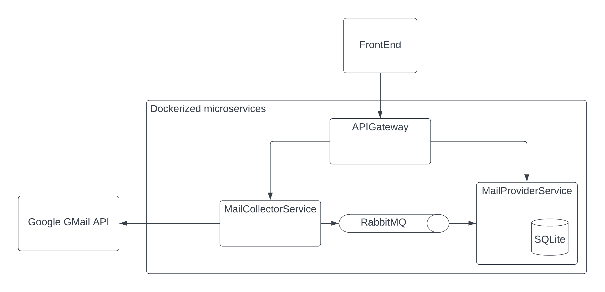

# EmailCleaner

Current status: Working on v1

A application which collects emails and groups them in different ways to make it easy to clean the inbox.
This is a practice project built with a microservice architecture for learning rather than performance.

Features: 
- Microservices in docker containers built with an API Gateway pattern
- RabbitMQ
- Service tests
- Console and file based front end
- Experimental .Net MAUI front end

## Overview



- RabbitMQ
Used between´for async communication configured between microservices.

- MailCollectorService
Runs a collector which retrieves emails from Google's GMail API and then publishes the emails to the RabbitMQ.

- MailProviderService
Stores and provides the emails from the RabbitMQ.

- APIGateway
Simple gateway for the microservices.


## Installation and setup

1. Setup MailCollectorService and run it once outside of docker-compose to setup OAuth2 for the Google API 
2. Setup MailProviderService
3. Setup APIGateway
4. Run docker-compose up for the backend
5. Setup front end
6. Run front end on local machine

### MailCollectorService

1. Add MessageQueue options to appsettings in MailCollectorService. Get exchange from RabbitMQ queue created.
2. Add Urls to appsettings.
3. Add Gmail options, see subsection below.
4. Run MailCollectorService outside of docker-compose once to setup OAuth2 token via browser window.
Can be added manually to folder "MailCollectorService/token.json". This folder is mounted through docker, 
so no need to rebuild image or container when token expires.

Example appsettings.json in MailCollectorService:
```
{
  "AllowedHosts": "*",
  "Gmail": {
    "ApplicationName": "EmailCleaner",
    "CredentialsFileName": "credentials.json",
    "UserId": "me"
  },
  "Urls": "http://+:5201",
  "MessageQueue": {
    "Exchange": "emails",
    "HostName": "rabbitmq_emailcleaner",
    "RoutingKeyCollected": "emails.collected"
  }
}
```


#### Google Cloud Project Setup

1. Go to https://console.cloud.google.com/ and create a new project
2. Add Google GMail API
3. Setup OAuth consent screen and add "Gmail API" scope to read and delete emails
4. Add yourself as a test user
5. Create OAuth2 credentials and download json-file and add to MailCollectorService
6. Add Gmail options in appsettings.json in MailCollectorService

Example Gmail-section from appsettings.json in MailCollectorService:
```
      "Gmail": {
        "ApplicationName": "EmailCleaner",
        "CredentialsFileName": "credentials.json",
        "UserId": "me"
      }
```

### MailProviderService

1. Add MessageQueue options to appsettings in MailProviderService. Use the below values, or match with RabbitMQ queue if created manually.

Example appsettings.json in MailProviderService:
```
{
  "AllowedHosts": "*",
  "Urls": "http://+:5202",
  "MessageQueue": {
    "Exchange": "emails",
    "HostName": "rabbitmq_emailcleaner",
    "RoutingKeyCollected": "emails.collected"
  }
}
```

### RabbitMQ between MailCollectorService and MailProviderService

Should be setup automatically by the docker-compose and RabbitMQ config files.
If not, setup the queue manually following these instructions:
https://itnext.io/how-to-build-an-event-driven-asp-net-core-microservice-architecture-e0ef2976f33f

## Future development

- Use IHttpClientFactory with retry policy instead of HttpClient
https://learn.microsoft.com/en-us/dotnet/architecture/microservices/implement-resilient-applications/use-httpclientfactory-to-implement-resilient-http-requests

### API Gateway

- Implement an authentication microservice for when connecting with the gateway, for example with JWT auth.

### MailCollectorService

- Enable delete emails
- Handle cancellation which throws: System.Threading.Tasks.TaskCanceledException
- Use batch requests instead. No difference for limit per minute, but faster.
- Download attachments
- Optimize the information sent. Remove body for example.
- Optimize the information requested from apis. Remove as much as possible.
- Handle Authorization exceptions thrown within docker container.

### MailProviderService

- Check routing key from message queue to enable delete
- Use file database instead of in memory to enable some persistance

